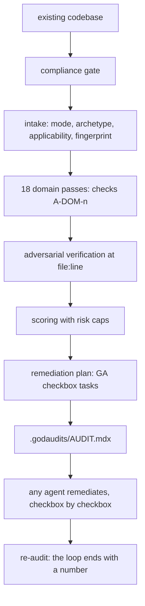

# godaudits

[](https://github.com/aihxp/godaudits/actions/workflows/lint.yml)
[](CHANGELOG.md)
[](skills/godaudits/SKILL.md)
[](LICENSE)

Audit everything after anything. godaudits is a single-command AI agent skill that inspects an existing codebase end to end and emits one master audit report (`.godaudits/AUDIT.mdx`): per-domain scores, evidence-backed findings, and an agent-executable remediation plan.

Most audit tooling checks one dimension at a time and hands back prose. godaudits runs every dimension the aihxp auditors cover (code quality, security, database, LLM integration, SEO, UI, UX) plus every discipline the aihxp arc tiers enforce (product reality, architecture, stack, repo, build completeness, delivery, deploy, observability, launch), verifies each finding at file:line, scores each domain with risk caps, and converts the findings into checkbox remediation tasks with verify commands that any coding agent can execute. It is the mirror of [godplans](https://github.com/aihxp/godplans): godplans inverts audit checks into plan-time requirements (R-SEC-3); godaudits runs the same checks forward against real code (A-SEC-3). Same numbering, same task grammar, closed loop.

## Quickstart

```bash
# recommended: the skills package manager (installs for your tools)
npx skills add aihxp/godaudits

# or: clone and run the installer
git clone https://github.com/aihxp/godaudits
cd godaudits && sh install.sh
```

Then, in your coding agent, in any project directory:

```
/godaudits
```

One command. godaudits screens the product against the Anthropic Usage Policy, fingerprints the repo (archetype, scale, surfaces), audits every applicable domain against its module's checks, adversarially verifies each finding at the cited file and line, scores each domain 0 to 100, and emits `.godaudits/AUDIT.mdx` with the remediation plan built in.

## What you get

One file, `.godaudits/AUDIT.mdx`, containing:

- A verdict paragraph: overall score, verdict band, the biggest risk and the biggest strength.
- Scope and method: the commit audited, what was examined, and the read-only guarantee (no source edits, no app execution, no live systems, no model calls).
- The compliance gate result and the applicability matrix (every domain audited or excluded with a reason).
- A scorecard: every applicable domain scored with a one-line reason, caps applied (any open Critical caps its domain at 69 and the overall at 79), overall as a weighted mean.
- Strengths, held to the same file:line evidence standard as faults.
- Findings with stable ids (F-SEC-3), a severity triple (Severity | Confidence | Effort), quoted evidence at file:line, concrete impact, a specific fix, and the exact command that verifies the fix.
- A remediation plan in phases: Stop the bleeding (all Criticals), Quick wins, Plan now, Verify first, Backlog, and a final Re-audit phase with the expected score movement. Every task: a stable GA-number, exact files, dependencies, the findings it fixes, grep-verifiable acceptance criteria, one verify command, and check traceability.
- Embedded rules for remediating agents and an append-only session log.

The audit is the handoff: any coding agent (the same one, or a different tool entirely) executes the remediation checkbox by checkbox. Progress is machine-checkable with grep. Interrupted work resumes by re-reading the file, not the chat.



## The godplans loop

godplans and godaudits share one numbering system and one task grammar:

- **Plan first**: godplans emits `.godplans/PLAN.mdx` where requirement `R-SEC-3` demands ownership predicates in every query.
- **Build**: any agent executes the plan.
- **Audit**: godaudits runs check `A-SEC-3` against the code. In plan-aware mode (it detects `.godplans/PLAN.mdx` automatically) every finding also cites the plan requirement it violates, and plan drift (checked tasks whose acceptance no longer holds) is audited as a first-class concern.
- **Remediate and re-audit**: the emitted remediation plan uses the same GA task grammar, and its final task is always a re-audit, so the loop ends with a score delta, not a feeling.

Either skill works alone. Together they close the loop.

## Modes

- **Fresh audit**: the full method against a codebase with no prior audit.
- **Re-audit**: `.godaudits/AUDIT.mdx` exists; every open finding is re-inspected at the new commit, statuses flip with evidence, new findings get new ids, history is never rewritten, and the scorecard opens with a delta table.
- **Plan-aware overlay**: `.godplans/PLAN.mdx` exists; conformance checks run inside every domain pass and findings carry R-ids next to A-ids.

## Tool support

The canonical skill lives at `skills/godaudits/` in the Agent Skills format and works in every Agent Skills client. `install.sh` exploits path convergence, so six destinations cover the ecosystem:

| Tool | Install path | Invoke |
|---|---|---|
| Claude Code | `~/.claude/skills/godaudits` | `/godaudits` |
| Codex CLI | `~/.agents/skills/godaudits` | `$godaudits` |
| Cursor | reads `.agents` and `.claude` paths | `/godaudits` |
| VS Code / Copilot | reads `.claude` and `.agents` paths; project `.github/skills` | `/godaudits` |
| Zed | `~/.agents/skills/godaudits` | `/godaudits` |
| OpenCode | reads `.claude` and `.agents` paths | auto |
| Windsurf | reads compat paths; native `~/.codeium/windsurf/skills` | `@godaudits` |
| Gemini CLI | `~/.agents/skills/godaudits` (or `gemini skills install <git-url>`) | auto |
| Amp | reads `.agents` and `.claude` paths | auto |
| Factory Droid | `~/.factory/skills/godaudits` | `/godaudits` |
| Cline | `~/.cline/skills/godaudits` | auto |
| T3 Chat | no skill support: paste [PROMPT.md](PROMPT.md) into Settings, Customization, or attach it to a chat | manual |
| Aider | `aider --read PROMPT.md` | manual |
| Any chat UI | paste [PROMPT.md](PROMPT.md) as the system prompt | manual |

`PROMPT.md` is the generated single-file fallback (SKILL.md plus the load-bearing references, flattened). Regenerate with `bash scripts/build-prompt.sh`.

## Lineage

godaudits consolidates twelve skills into one command:

| Source | What carries over |
|---|---|
| [codeauditor](https://github.com/aihxp/codeauditor) | Code-quality lenses, the 7-phase audit method, scored reports |
| [secauditor](https://github.com/aihxp/secauditor) | OWASP/CWE-grounded dimensions, paper-control hunting, automatic-Critical caps |
| [dbauditor](https://github.com/aihxp/dbauditor) | Schema, indexing, transactions, migrations, data protection |
| [llmauditor](https://github.com/aihxp/llmauditor) | LLM-integration dimensions: prompts, routing, cost, evals, guardrails |
| [seoauditor](https://github.com/aihxp/seoauditor) | Search and AI-answer-engine visibility from the code alone |
| [uiauditor](https://github.com/aihxp/uiauditor) | Accessibility, semantics, design-system consistency |
| [uxauditor](https://github.com/aihxp/uxauditor) | Journeys, workflows, error states |
| [arc-ready](https://github.com/aihxp/arc-ready) / [ready-suite](https://github.com/aihxp/ready-suite) | The tier disciplines audited as reality checks: PRD, architecture, roadmap, stack, repo, build, deploy, observe, launch, harden |
| [pillars](https://github.com/aihxp/pillars) | The agent-memory standard, audited for presence and truthfulness |
| [codedna](https://github.com/aihxp/codedna) | The style genome, fingerprinted and checked for drift |
| [godplans](https://github.com/aihxp/godplans) | The shared R/A numbering, the task grammar, GFM-safe MDX, executor rules |

## Anthropic policy awareness

godaudits is built to keep accounts clean, per the [Anthropic Usage Policy](https://www.anthropic.com/legal/aup):

- A compliance gate screens every product before auditing it: prohibited purposes are refused with the policy category named (improving a prohibited product is facilitating it), and policy-risk components found in the code (undisclosed AI chat, subscription OAuth tokens wired into cron, scrapers without robots.txt respect) become mandatory compliance findings with remediation tasks.
- The skill never coaches a model past a refusal and never suggests routing subscription OAuth outside official clients, the two behaviors most correlated with real-world account bans. Any remediation task that automates model calls specifies API-key auth.
- The same screening logic applies in non-Claude harnesses; every provider has an equivalent policy.

Details in [references/compliance.md](skills/godaudits/references/compliance.md).

## Repository map

| Path | Role |
|---|---|
| `skills/godaudits/SKILL.md` | The orchestrator: ground rules, the 8-phase method, modes, refusals |
| `skills/godaudits/references/` | 22 modules: 18 domain playbooks plus audit-format, intake, compliance, exemplar |
| `skills/godaudits/templates/AUDIT.template.mdx` | The audit skeleton |
| `.agents/skills/`, `.claude/skills/` | Symlink projections of the canonical skill |
| `install.sh` | Six-destination installer; `--project`, `--tools`, `--copy`, `--uninstall` |
| `PROMPT.md` | Generated portable fallback |
| `scripts/lint.sh` | Meta-linter: unicode cleanliness, version parity, module contracts, PROMPT freshness |
| `docs/ABOUT.md` | The long-form writeup: why godaudits exists and how it was designed |

## FAQ

**Why MDX?** The audit drops into MDX pipelines (Docusaurus, Nextra, Fumadocs) and MDX-native viewers, but the body is written GFM-safe: plain GitHub-flavored markdown that is simultaneously valid MDX. Rename to `AUDIT.md` any time for GitHub rich rendering; nothing is lost.

**Does godaudits fix the findings?** No. It audits, then plans the fix. The emitted AUDIT.mdx carries its own executor rules, so any coding agent can remediate from it. That separation is deliberate: an auditor that edits while it audits invalidates its own evidence.

**Is it safe to run on production code?** Yes, by construction: godaudits never edits source, never runs the application or its tests, never connects to a live database, never calls a model, and writes only under `.godaudits/`.

**What if my project has no UI / no LLM / no public pages?** Every domain is either audited or excluded with a stated reason in the applicability matrix. A CLI tool excludes seo with a reason; it never gets a hollow SEO section or a padded score.

**How is this different from running the seven auditors separately?** One command, one fingerprint pass instead of seven, an ownership map so one root cause is never billed in four domains, one combined scorecard with caps, and one remediation plan in a single executable grammar, plus the eleven arc-tier and memory dimensions the standalone auditors never covered.

## License

[MIT](LICENSE). Contributions welcome; read [CONTRIBUTING.md](CONTRIBUTING.md) first, especially the mechanically enforced style rules.
