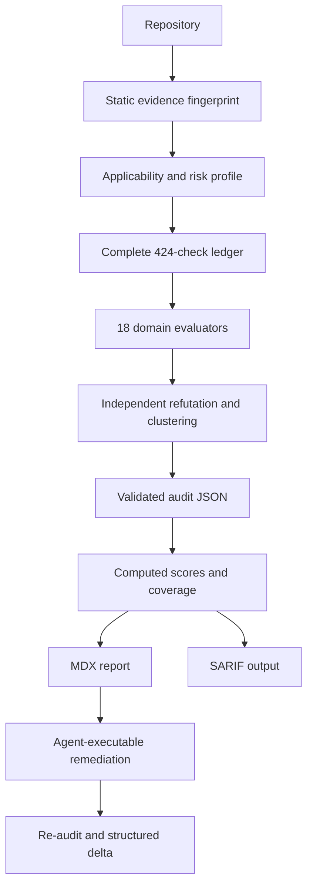

# godaudits

[](https://github.com/hannsxpeter/godaudits/actions/workflows/lint.yml)
[](CHANGELOG.md)
[](skills/godaudits/SKILL.md)
[](LICENSE)

Audit everything after anything. godaudits is an evidence-first codebase audit
system that combines a 424-check Agent Skill with a zero-dependency runtime. It
produces validated machine state, computed scores and coverage, a standalone
remediation report, and optional SARIF annotations.

Version 2.1 adds form-aware context, Pillars 1.1 routing, arc-ready 1.1 artifact
truth, evidence freshness, and OWASP Web Top 10:2025 coverage to the validated
version 2 engine. The model still performs
the work that requires judgment: tracing code paths, testing competing
explanations, clustering root causes, calibrating impact, and prescribing a
specific fix. The runtime performs work that should never depend on model mood:
catalog compilation, repository fingerprinting, secret-safe signal collection,
check completeness, score arithmetic, cross-reference validation, dependency
cycle detection, rendering, re-audit diffs, and benchmark metrics.

## What makes it different

- 18 domains and 424 versioned checks, each with inspection and failure
  guidance.
- Six project forms, secondary-form composition, all 37 arc-ready profiles, and
  conservative product, industry, and regulatory candidates.
- Pillars 1.1 structural validation and deterministic nested-scope routing with
  present, stub, excluded, absent, and unknown states.
- Arc-ready 1.1 table-ledger validation, artifact hashes, dependency-order drift,
  Git-history freshness with an explicit non-Git fallback, and launch
  prepublication checks bound to a content hash or Git revision.
- Explicit OWASP Web Top 10:2025 coverage without duplicate score weight.
- Every applicable check records `pass`, `fail`, `unknown`, or
  `not-applicable`. Uninspected never means pass.
- Quality score and audit coverage are separate. Low coverage caps the verdict.
- Evidence supports source, absence, tool, runtime, and human records.
- Source evidence carries a content hash. Secret evidence is masked and
  fingerprinted.
- Scores are computed from catalog weights and outcomes, with Critical,
  weak-domain, and coverage caps.
- Findings and remediation tasks are reciprocal and validator-enforced.
- Accepted risks require an owner, acceptance date, expiry, and review command.
- Re-audits preserve ids and produce structured added, resolved, reopened,
  changed, removed-id, score, and coverage deltas.
- MDX and SARIF are generated views. JSON is the source of truth.
- SARIF scanners can be imported as redacted evidence without promoting their
  conclusions into findings.
- An eight-repository fixture corpus, deterministic product evaluations, and
  live-harness cases test the auditor itself.
- JSON Schema 2020-12 validation tests real emitted evidence and rejects
  malformed nested project-context and Pillars contracts.

## Quickstart

Install the Agent Skill:

```bash
npx skills add hannsxpeter/godaudits
```

Or clone and install it for detected tools:

```bash
git clone https://github.com/hannsxpeter/godaudits
cd godaudits
sh install.sh
```

The installer marks managed copies and refuses to replace or uninstall an
unowned `godaudits` directory. Move a pre-existing custom directory aside
explicitly before installation.

Then invoke it inside an existing project:

```text
/godaudits
```

The runtime is bundled inside the skill. Agents use the installed `godaudits`
command when available, or run `runtime/godaudits.js` beside SKILL.md with Node
18 or newer.

## Outputs

All audit writes stay under `.godaudits/`:

| Artifact | Role |
|---|---|
| `EVIDENCE.json` | Deterministic file inventory, hashes, signals, forms, overlays, arc artifacts, Pillars state, absences, and limitations |
| `AUDIT.json` | Canonical schema-versioned check, standards, evidence, finding, task, risk, freshness, and computed state |
| `AUDIT.mdx` | Generated standalone report and remediation handoff |
| `AUDIT.sarif` | Optional SARIF 2.1.0 output for code-host annotations |
| `TOOL-EVIDENCE.json` | Optional secret-safe evidence imported from SARIF scanners |
| `archive/` | Paired prior JSON and MDX versions for re-audit history |

`AUDIT.json` is authoritative. MDX and SARIF are disposable derived views.

## The audit workflow



The normal command sequence is:

```bash
godaudits doctor
godaudits evidence . --output .godaudits/EVIDENCE.json
godaudits pillars . --task "audit request routing" --target src/router.js
godaudits init --name my-project --scale funded-product --profile security-critical --applicable all --evidence .godaudits/EVIDENCE.json --output .godaudits/AUDIT.json
godaudits validate .godaudits/AUDIT.json --repo . --require-fresh-evidence --write
godaudits render .godaudits/AUDIT.json --output .godaudits/AUDIT.mdx
godaudits sarif .godaudits/AUDIT.json --output .godaudits/AUDIT.sarif
```

Import existing SARIF scanner results as evidence leads, never automatic
findings:

```bash
godaudits import-sarif scanner.sarif --start 1000 --output .godaudits/TOOL-EVIDENCE.json
```

The Agent Skill orchestrates these commands and performs the domain judgment
between initialization and validation.

## Capability modes

Static mode is the default:

- Reads repository source and git metadata.
- Writes only under `.godaudits/`.
- Does not run the application, tests, migrations, live systems, product
  network requests, or product model calls.

Two stronger evidence modes are available only with explicit authority:

- Sandbox: commands run in a disposable environment with outbound network
  disabled and no production credentials.
- Connected: explicitly authorized read-only evidence from CI, observability,
  database metadata, or trackers, with query and provenance recorded.

Static inference is never presented as runtime fact. Claims requiring stronger
evidence stay Tentative or unknown.

## Check catalog and scoring

The generated catalog at
[`skills/godaudits/catalog/checks.json`](skills/godaudits/catalog/checks.json)
contains all checks, source modules, source lines, inspection guidance, failure
guidance, scoring dimensions, routing behavior, and default weights.

Risk profiles live in
[`skills/godaudits/catalog/profiles.json`](skills/godaudits/catalog/profiles.json):

- `balanced`: default general product risk.
- `security-critical`: identity, money, regulated data, privileged actions, and
  multi-tenant workloads.
- `growth`: public products dominated by activation, visibility, conversion,
  and launch execution.
- `library`: libraries and developer tools dominated by compatibility, API
  quality, maintainability, and repository discipline.

The chosen profile is recorded in the audit and cannot be switched to improve a
score without changing the machine state and audit trail. Every profile's
domain weights total 100 and are validated with the generated catalog.

## Validation

`godaudits validate` rejects:

- Missing domains or checks, unknown ids, stale pack versions, or modified
  catalog weights.
- Pass, fail, and not-applicable outcomes without evidence.
- Failed checks without findings or open findings attached to passing checks.
- Missing, duplicate, malformed, or unredacted sensitive evidence.
- Certain Critical or High findings without two independent evidence paths.
- One-way finding-task links, missing Critical or High closure, dependency
  cycles, unsafe parallel file overlap, and incomplete final re-audit
  dependencies.
- Invalid, expired, or ownerless risk and open-question records.
- Unknown compliance results without an owned question, or injected compliance
  results without a finding and task.
- Hand-authored scores or counters that disagree with derived state.
- Stale repository evidence, incomplete OWASP category ledgers, or unsupported
  form and overlay metadata.

Coverage caps prevent a polished subset from masquerading as a full audit.

## Evaluation and benchmarks

The built-in corpus covers Node API, Python worker, Go CLI, clean Rust library,
web application, mobile or desktop, data or ML, and infrastructure or IaC
fixtures. It tests deterministic evidence collection, compatibility archetype
classification, all six project forms, absence evidence, clean controls, and
secret redaction:

```bash
npm run benchmark
npm run eval
```

When an expected-finding manifest exists, evaluate an actual audit:

```bash
godaudits evaluate .godaudits/AUDIT.json expected.json
```

Metrics include recall, precision, severity accuracy, citation validity,
remediation closure, clean-control rate, misses, and false positives. The
built-in corpus is a runtime regression net, not proof that an unseen model
audit is accurate. Behavioral cases and the result template live under
`evals/`; they are never reported as passed without retained harness evidence.

## Re-audits

Re-audit mode preserves historical ids and compares compiled states:

```bash
godaudits diff .godaudits/archive/AUDIT-v1.json .godaudits/AUDIT.json
```

The delta reports added, resolved, reopened, changed, and improperly removed
findings plus task, score, and coverage movement. It exits nonzero on project
mismatch, invalid re-audit metadata, or removed finding and task history.
Evidence hashes identify changed or moved source.

## Portable prompts

- `PROMPT.md` is compact. It contains the orchestrator and core contracts. It
  is only suitable for focused audits when the requested domain modules are
  separately available.
- `PROMPT.full.md` contains all 18 modules and the report contract. Use it for a
  standalone full audit when the client context window permits it.

The compact prompt explicitly requires unavailable checks to remain unknown. It
cannot silently claim a full audit.

## Tool support

| Tool | Skill path | Invoke |
|---|---|---|
| Claude Code | `~/.claude/skills/godaudits` | `/godaudits` |
| Codex, Cursor, Zed, Gemini CLI, OpenCode, Amp | `~/.agents/skills/godaudits` | tool-native or auto |
| Factory Droid | `~/.factory/skills/godaudits` | `/godaudits` |
| Cline | `~/.cline/skills/godaudits` | auto |
| Windsurf | `~/.codeium/windsurf/skills/godaudits` | `@godaudits` |
| VS Code or Copilot project install | `.github/skills/godaudits` | `/godaudits` |
| Aider or plain chat | `PROMPT.full.md` | attach or read |

The runtime is inside the canonical skill directory, so skill-only installs do
not lose validation or rendering support.

## The godplans loop

godaudits mirrors [godplans](https://github.com/hannsxpeter/godplans):

- godplans requirement `R-SEC-3` demands ownership predicates.
- godaudits check `A-SEC-3` evaluates them in built code.
- Plan-aware findings carry both ids.
- Remediation tasks preserve that traceability.
- The final task is always a compiled re-audit.

Either tool works alone. Together they close plan, build, audit, remediate, and
verify into one id system.

## Repository map

| Path | Role |
|---|---|
| `skills/godaudits/SKILL.md` | Canonical orchestrator |
| `skills/godaudits/references/` | Core contracts and 18 domain modules |
| `skills/godaudits/catalog/` | Generated checks, risk profiles, project context, and standards mappings |
| `skills/godaudits/schemas/` | Audit, evidence, and benchmark schemas |
| `skills/godaudits/runtime/` | Self-contained zero-dependency engine |
| `skills/godaudits/policies/` | Versioned compliance policy packs |
| `benchmarks/` | Multi-language deterministic corpus |
| `evals/` | Live-harness behavioral cases and result contract |
| `test/` | Compiler, evidence, renderer, evaluator, init, diff, and SARIF tests |
| `scripts/lint.sh` | Repository, runtime, catalog, schema, benchmark, and prompt gates |
| `scripts/validate-evidence-schema.py` | Pinned JSON Schema 2020-12 evidence validation |
| `docs/ENGINE.md` | Runtime architecture and invariants |
| `docs/EVALUATION.md` | Benchmark and accuracy methodology |
| `docs/MIGRATION-2.0.md` | Version 1 to version 2 migration |
| `docs/MIGRATION-2.1.md` | Version 2.0 to version 2.1 migration |
| `docs/THREAT-MODEL.md` | Auditor safety and evidence threat model |

## Development

```bash
npm test
npm run benchmark
npm run eval
npm run catalog
npm run build:prompt
npm run check
npm run release:check
```

Generated catalog and prompts have non-mutating freshness checks in CI. See
[CONTRIBUTING.md](CONTRIBUTING.md).

## License

[MIT](LICENSE)
