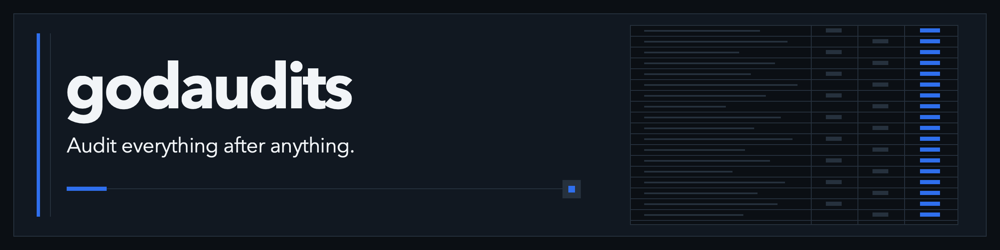
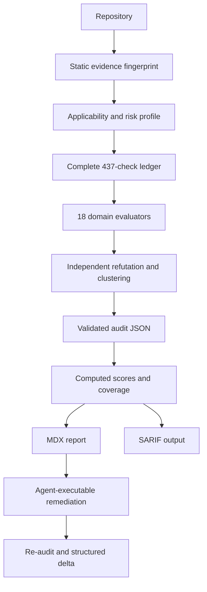

# godaudits

[](https://github.com/hannsxpeter/godaudits/actions/workflows/lint.yml)
[](CHANGELOG.md)
[](skills/godaudits/SKILL.md)
[](#what-it-examines)
[](skills/godaudits/catalog/checks.json)
[](LICENSE)

**Audit everything after anything.**

Ship first, find out later. That is how most software gets built now, and it
works right up until someone asks how good the thing actually is.

godaudits answers that question. It is one command you run inside an existing
codebase. It reads the project, grades it across 18 areas of software quality,
shows the evidence behind every judgment, and hands back a repair plan detailed
enough for an AI coding agent to work through task by task.

It runs inside the AI coding tools you already use, as an Agent Skill: a
package of instructions and tooling your assistant loads when you ask for it.
Nothing to host, no account to create, no code leaving your machine.

## Who it is for

- **Builders shipping fast with AI**, who want to know what is weak before a
  customer finds it.
- **Anyone who just inherited a codebase** and needs a map of the risk before
  touching anything.
- **Teams approaching a launch, a funding milestone, or a customer security
  review**, who need a defensible picture rather than a gut feeling.
- **Anyone doing diligence** on an acquisition, a contractor handoff, or an
  open-source dependency.

It is not a replacement for a penetration test, a lawyer, or a human security
review. It is the map you bring to one.

## Two minutes to your first audit

Install the skill:

```bash
npx skills add hannsxpeter/godaudits
```

Or clone and install it for whichever tools you have:

```bash
git clone https://github.com/hannsxpeter/godaudits
cd godaudits
sh install.sh
```

Then open any project in your coding agent and ask for an audit:

```text
/godaudits
```

That is the whole workflow. Everything it writes goes into a single
`.godaudits/` folder inside your project. It does not touch your source code,
and by default it does not run your application, your tests, or anything on the
network.

You can narrow the job the same way you would brief a person:

```text
/godaudits focus on security and the database before our launch
```

## What you get

**A report you can hand to someone.** `AUDIT.mdx` is a standalone document:
scores per area, the findings behind each score, what is strong as well as what
is broken, and the repair plan. It reads on its own, without the chat session
that produced it.

**A score you can defend.** Every area gets a number, and every number is
computed from recorded outcomes and published weights. There is no way to talk
the score up without changing the underlying facts, and no way to raise it by
quietly skipping the hard checks.

**A repair plan a machine can execute.** Findings are not advice. Each one
comes with numbered tasks that name the files, the order, and what proves the
work is done. Hand the plan to a coding agent and it can start at the top.

**A record that survives the session.** The full state is saved as structured
data, so the next audit can compare against this one and tell you exactly what
got better, what got worse, and what came back.

| File | What it is |
|---|---|
| `AUDIT.mdx` | The readable report and repair plan |
| `AUDIT.json` | The source of truth: every check, finding, task, and score |
| `EVIDENCE.json` | What was found in the repository, with hashes |
| `AUDIT.sarif` | Optional output that annotates code on GitHub and similar hosts |
| `TOOL-EVIDENCE.json` | Optional results imported from other scanners |
| `archive/` | Previous audits, kept so re-audits can be compared |

`AUDIT.json` is authoritative. The report and the SARIF file are generated
views of it, and can be thrown away and regenerated at any time.

## Why you can trust the result

AI tools are good at sounding confident. This one is built to make confidence
expensive.

- **Nothing unexamined is counted as fine.** Every check ends as pass, fail,
  unknown, or not applicable. Unknown stays visible in the report, and enough
  unknowns cap the final grade. A polished audit of a small slice cannot
  masquerade as a full one.
- **Every judgment points at a line of code.** Findings carry file and line
  evidence, and the evidence carries a content hash, so a claim cannot survive
  the code moving underneath it.
- **The arithmetic is not done by a model.** Scores, counters, coverage, and
  cross-references are computed by a small bundled program, not remembered by
  an AI. A hand-written score that disagrees with the recorded facts is
  rejected outright.
- **Findings are argued against before they ship.** Candidate findings go
  through an independent refutation pass, and related symptoms are clustered
  back to one root cause instead of being padded into a longer list.
- **It reads, it does not run.** The default mode never executes your
  application, your tests, your migrations, or a network request. Stronger
  evidence modes exist, and they require your explicit say-so.
- **Secrets never land in the report.** Anything that looks like a credential
  is masked and fingerprinted before it enters an artifact.
- **The misses are published too.** Accuracy results, including a measured null
  result and a real miss against a known CVE, are recorded in
  [`ACCURACY.md`](ACCURACY.md). A benchmark that only retains wins is
  marketing, not evidence.

## What it examines

Eighteen areas, 437 individual checks. Each check knows what to inspect, what
failure looks like, and how much it is worth.

| Area | The question it answers | Checks |
|---|---|---:|
| Product (`product`) | Does the software do what it promises? | 21 |
| Architecture (`architecture`) | Do the pieces fit, and hold up under load? | 29 |
| Stack (`stack`) | Are the chosen technologies still the right bet? | 24 |
| Database (`database`) | Is the data modeled, indexed, and protected properly? | 24 |
| Security (`security`) | Can it be broken into or abused? | 33 |
| AI integration (`llm`) | Are the model calls safe, bounded, and evaluated? | 25 |
| User experience (`ux`) | Do the real journeys through the product work? | 22 |
| Interface (`ui`) | Is the UI consistent, accessible, and finished? | 24 |
| Search visibility (`seo`) | Can search and AI answer engines find it? | 25 |
| Code quality (`code-quality`) | Is it readable, tested, and safe to change? | 26 |
| Style consistency (`style-genome`) | Does new code look like the code around it? | 23 |
| Agent memory (`agent-memory`) | Do the AI instruction files actually load and help? | 24 |
| Repository (`repo`) | Is the project set up for others to work in? | 24 |
| Build completeness (`build`) | Is anything half-built, stubbed, or faked? | 22 |
| Roadmap (`roadmap`) | Is the sequence of work coherent and honest? | 23 |
| Deployment (`deploy`) | Can it ship safely, and roll back? | 21 |
| Observability (`observe`) | Would you know when it breaks? | 24 |
| Launch readiness (`launch`) | Is it actually ready for the public? | 23 |

Security coverage includes an explicit walkthrough of the OWASP Web Top
10:2025, counted once so it cannot inflate the score twice. Security and build
completeness are the two areas audited in real depth; the rest are graded as a
thorough screening, and each one says when a specialist should take over.
Per-check detail lives in [`docs/CHECK-MAP.md`](docs/CHECK-MAP.md).

## How it works


```mermaid
flowchart TD
  A[Repository] --> B[Static evidence fingerprint]
  B --> C[Applicability and risk profile]
  C --> D[Complete 437-check ledger]
  D --> E[18 domain evaluators]
  E --> F[Independent refutation and clustering]
  F --> G[Validated audit JSON]
  G --> H[Computed scores and coverage]
  H --> I[MDX report]
  H --> J[SARIF output]
  I --> K[Agent-executable remediation]
  K --> L[Re-audit and structured delta]
```

The system has two halves, and the split is the whole design.

**The model does the judgment.** Tracing how a request actually flows through
the code, testing competing explanations, deciding whether twelve complaints
share one cause, calibrating how bad something really is, and writing a fix
specific enough for someone else to apply. That work needs reading
comprehension.

**The runtime does everything that should never depend on model mood.** Taking
inventory of the repository, compiling the check catalog, collecting signals
without executing anything, verifying that every applicable check was accounted
for, doing the score arithmetic, checking every cross-reference, detecting
circular dependencies in the repair plan, rendering the report, and comparing
re-audits. It is a zero-dependency program that ships inside the skill.

Neither half is trustworthy alone. A model should not be asked to hold 437
checks in its head or reproduce arithmetic by hand. A program cannot tell you
whether an authorization check truly binds, or whether a product promise is
honest. More on the split in [`docs/ABOUT.md`](docs/ABOUT.md).

## Choosing the scope

Two dials keep an audit proportionate to the question you are asking.

**Risk profile** decides what matters most, and is recorded in the audit so it
cannot be swapped afterwards to flatter the score:

- `balanced`: the default, for general products.
- `security-critical`: identity, money, regulated data, privileged actions,
  multi-tenant workloads.
- `growth`: public products where activation, visibility, and conversion
  dominate.
- `library`: libraries and developer tools, where compatibility, API quality,
  and repository discipline dominate.

**Budget** decides how deep to dig. Focused, medium-budget audits are the
default and the usual right answer. A full audit keeps every deep-trace check
in play and costs considerably more. Anything skipped stays in the report as
unknown and lowers coverage, so a cheap audit is honest about being cheap.

## Under the hood

Everything below is for readers who want the mechanics. You do not need any of
it to run an audit.

### The commands behind the skill

The skill orchestrates a small command-line runtime and supplies the judgment
between initialization and validation:

```bash
godaudits doctor
godaudits evidence . --output .godaudits/EVIDENCE.json
godaudits pillars . --task "audit request routing" --target src/router.js
godaudits init --name my-project --scale funded-product --profile security-critical --applicable security,build,repo --budget medium --evidence .godaudits/EVIDENCE.json --output .godaudits/AUDIT.json
godaudits validate .godaudits/AUDIT.json --repo . --require-fresh-evidence --write
godaudits render .godaudits/AUDIT.json --output .godaudits/AUDIT.mdx
godaudits sarif .godaudits/AUDIT.json --output .godaudits/AUDIT.sarif
godaudits wayfind .godaudits/AUDIT.json
```

The runtime is bundled inside the skill. Agents use the installed `godaudits`
command when available, or run `runtime/godaudits.js` beside SKILL.md with Node
22 or newer. The installer marks its own copies and refuses to replace or
uninstall a `godaudits` directory it does not own.

### What the validator refuses

`godaudits validate` is the gate that makes the guarantees above enforceable
rather than aspirational. It rejects:

- Missing domains or checks, unknown ids, stale pack versions, or modified
  catalog weights.
- Pass, fail, and not-applicable outcomes without evidence.
- Failed checks without findings, or open findings attached to passing checks.
- Missing, duplicate, malformed, or unredacted sensitive evidence.
- Certain Critical or High findings without two independent evidence paths.
- One-way finding-task links, missing Critical or High closure, dependency
  cycles, unsafe parallel file overlap, and incomplete final re-audit
  dependencies.
- Invalid, expired, or ownerless risk and open-question records.
- Unknown compliance results without an owned question, or injected compliance
  results without a finding and task.
- Hand-authored scores or counters that disagree with derived state.
- Stale repository evidence, incomplete OWASP category ledgers, or unsupported
  form and overlay metadata.

Accepted risks are allowed, but each one needs an owner, an acceptance date, an
expiry, and the command that revisits it.

### Capability modes

Static mode is the default: it reads repository source and git metadata, writes
only under `.godaudits/`, and does not run the application, tests, migrations,
live systems, product network requests, or product model calls.

Two stronger modes require explicit authority:

- **Sandbox**: commands run in a disposable environment with outbound network
  disabled and no production credentials.
- **Connected**: explicitly authorized read-only evidence from CI,
  observability, database metadata, or trackers, with the query and provenance
  recorded.

Static inference is never presented as runtime fact. Claims that need stronger
evidence stay tentative or unknown. See
[`docs/THREAT-MODEL.md`](docs/THREAT-MODEL.md).

### Project shape detection

Before grading anything, the runtime works out what kind of project this is: six
project forms with secondary-form composition, all 37 arc-ready profile
candidates, and conservative product, industry, and regulatory candidates. It
also validates Pillars 1.1 structure with deterministic nested-scope routing
(present, stub, excluded, absent, unknown), arc-ready 1.1 table-ledger state,
artifact hashes, dependency-order drift, and freshness against Git history with
an explicit fallback when there is no Git history to read.

Regulatory candidates are candidates. The audit will not assert that a law
applies to you.

### The check catalog

The generated catalog at
[`skills/godaudits/catalog/checks.json`](skills/godaudits/catalog/checks.json)
holds every check with its source module and line, inspection guidance, failure
guidance, scoring dimensions, routing behavior, cost tier, depth label,
specialist escalation criteria, and default weight. Risk profiles live in
[`skills/godaudits/catalog/profiles.json`](skills/godaudits/catalog/profiles.json),
and every profile's domain weights are validated to total 100.

### Importing other scanners

Results from SARIF, Semgrep, ast-grep, Gitleaks, and OSV-Scanner can be
imported as versioned, redacted evidence. They become leads for the audit to
verify, never findings promoted on the strength of another tool's conclusion:

```bash
godaudits import-sarif scanner.sarif --start 1000 --output .godaudits/TOOL-EVIDENCE.json
godaudits import-tool semgrep.json --tool semgrep --command "semgrep scan --json ." --start 1000 --output .godaudits/TOOL-EVIDENCE.json
godaudits import-tool ast-grep.json --tool ast-grep --tool-version VERSION --command "ast-grep scan --json=pretty" --start 2000 --output .godaudits/TOOL-EVIDENCE.json
godaudits import-tool gitleaks.json --tool gitleaks --tool-version VERSION --command "gitleaks dir --report-format json" --start 3000 --output .godaudits/TOOL-EVIDENCE.json
godaudits import-tool osv.json --tool osv-scanner --tool-version VERSION --command "osv-scanner scan --format json ." --start 4000 --output .godaudits/TOOL-EVIDENCE.json
```

### Reading the repair plan as a route

A list of phases and waves tells you what the audit decided. It does not tell
you what you can start right now. `wayfind` reads the same plan as a route:

```bash
godaudits wayfind .godaudits/AUDIT.json
godaudits wayfind .godaudits/AUDIT.json --format json
```

It reports the destination, the frontier (open tasks whose dependencies are all
closed and which no other session has claimed), what is blocked and by which
named task, what is in scope but unresolved, and what was ruled out of scope
and why. It compiles nothing and changes nothing, so it stays correct on a
half-finished plan and the instant a task closes.

Fog and scope stay separate on purpose. An unknown check is a precise question
the audit left unanswered, and it lowers confidence in the grade. A
not-applicable check or an excluded area was ruled outside the destination, and
never graduates inside this audit. Collapsing the two would let a coverage gap
read as a deliberate boundary. See
[`docs/WAYFINDING.md`](docs/WAYFINDING.md).

### Re-audits

Re-audit mode preserves historical ids and compares compiled states:

```bash
godaudits diff .godaudits/archive/AUDIT-v1.json .godaudits/AUDIT.json
```

The delta reports added, resolved, reopened, changed, and improperly removed
findings, plus task, score, and coverage movement. It exits nonzero on project
mismatch, invalid re-audit metadata, or removed finding and task history.
Evidence hashes identify source that changed or moved.

### Testing the auditor itself

An eight-repository fixture corpus covers Node API, Python worker, Go CLI, a
clean Rust library, a web application, mobile or desktop, data or ML, and
infrastructure fixtures. It tests deterministic evidence collection, archetype
classification, all six project forms, absence evidence, clean controls, and
secret redaction:

```bash
npm run benchmark
npm run eval:suites
```

A separate seeded-defect corpus answers a different question: after a catalog
change, do the defects deliberately planted for a check still get caught? The
gate turns red when a seeded check leaves the catalog or stops being detected.
Authored cases earn regression coverage and nothing else; only a recorded real
audit run may contribute to a detection rate.

```bash
npm run test:detectors
```

When an expected-finding manifest exists, an actual audit can be scored:

```bash
godaudits evaluate .godaudits/AUDIT.json expected.json
```

Metrics include recall, precision, severity accuracy, citation validity,
remediation closure, clean-control rate, misses, and false positives.

The built-in corpus is a regression net for the runtime, not proof that an
unseen model audit is accurate. The standing published result, including misses
and false positives, is in [`ACCURACY.md`](ACCURACY.md): the first complete
paired suite measured no lift from installing the skill, and the first external
open-source audit recorded one miss against CVE-2015-9235. Both are published
because a benchmark that retains only wins is not evidence. Methodology is in
[`docs/EVALUATION.md`](docs/EVALUATION.md).

### Portable prompts

For tools without skill support:

- `PROMPT.md` is compact. It carries the orchestrator and core contracts, and
  suits focused audits when the requested domain modules are separately
  available. It explicitly requires unavailable checks to stay unknown, so it
  cannot quietly claim a full audit.
- `PROMPT.full.md` carries all 18 modules and the report contract. Use it for a
  standalone full audit when the context window allows.

### Where it installs

| Tool | Skill path | Invoke |
|---|---|---|
| Claude Code | `~/.claude/skills/godaudits` | `/godaudits` |
| Codex, Cursor, Zed, Gemini CLI, OpenCode, Amp | `~/.agents/skills/godaudits` | tool-native or auto |
| Factory Droid | `~/.factory/skills/godaudits` | `/godaudits` |
| Cline | `~/.cline/skills/godaudits` | auto |
| Windsurf | `~/.codeium/windsurf/skills/godaudits` | `@godaudits` |
| VS Code or Copilot project install | `.github/skills/godaudits` | `/godaudits` |
| Aider or plain chat | `PROMPT.full.md` | attach or read |

The runtime lives inside the canonical skill directory, so a skill-only install
still has validation and rendering.

### Plan and audit as one loop

godaudits is the mirror of [godplans](https://github.com/hannsxpeter/godplans),
which plans a project before the code exists. The two share one numbering
system:

- godplans requirement `R-SEC-3` demands ownership predicates.
- godaudits check `A-SEC-3` evaluates them in the code that got built.
- Findings carry both ids, and repair tasks preserve that traceability.
- The final task of every plan is a compiled re-audit.

Either tool works alone. Together they close plan, build, audit, repair, and
verify into one loop.

## Repository map

| Path | Role |
|---|---|
| `skills/godaudits/SKILL.md` | Canonical orchestrator |
| `skills/godaudits/references/` | Core contracts and 18 domain modules |
| `skills/godaudits/catalog/` | Generated checks, risk profiles, project context, and standards mappings |
| `skills/godaudits/schemas/` | Audit, evidence, and benchmark schemas |
| `skills/godaudits/runtime/` | Self-contained zero-dependency engine |
| `skills/godaudits/policies/` | Versioned compliance policy packs |
| `benchmarks/` | Multi-language deterministic corpus |
| `ACCURACY.md` | Versioned model-run results, gaps, misses, and false positives |
| `evals/` | Live-harness behavioral cases and result contract |
| `test/` | Compiler, evidence, renderer, evaluator, init, diff, and SARIF tests |
| `scripts/lint.sh` | Repository, runtime, catalog, schema, benchmark, and prompt gates |
| `scripts/validate-evidence-schema.py` | Pinned JSON Schema 2020-12 evidence validation |
| `docs/ABOUT.md` | Why the judgment and determinism split exists |
| `docs/ENGINE.md` | Runtime architecture and invariants |
| `docs/CHECK-MAP.md` | Every check, by domain |
| `docs/EVALUATION.md` | Benchmark and accuracy methodology |
| `docs/WAYFINDING.md` | Destination, frontier, claims, fog, and scope boundary |
| `docs/RELEASE-POLICY.md` | Release cadence and external audit publication contract |
| `dogfood/` | Indexed external open-source audits; an empty index makes no track-record claim |
| `docs/MIGRATION-2.0.md` | Version 1 to version 2 migration |
| `docs/MIGRATION-2.1.md` | Version 2.0 to version 2.1 migration |
| `docs/THREAT-MODEL.md` | Auditor safety and evidence threat model |

## Development

```bash
npm test
npm run benchmark
npm run accuracy:check
npm run eval:suites
npm run catalog
npm run build:prompt
npm run check
npm run release:check
```

Generated catalog and prompts have non-mutating freshness checks in CI. Release
notes are in [`CHANGELOG.md`](CHANGELOG.md); contribution rules are in
[`CONTRIBUTING.md`](CONTRIBUTING.md).

## License

[MIT](LICENSE)
